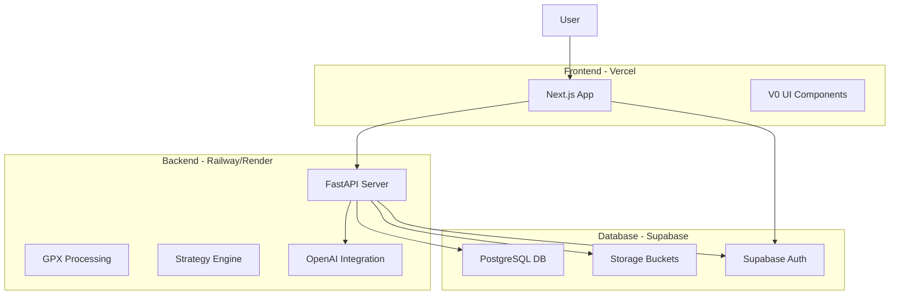

# Full-Stack Race Strategy Generator - Complete Roadmap

## Architecture Overview



## Tech Stack Summary

**Frontend:**

- Next.js 15 (App Router)
- TypeScript
- Tailwind CSS + shadcn/ui
- V0 for component design
- Recharts for visualizations

**Backend:**

- FastAPI (Python)
- SQLAlchemy + asyncpg
- Pydantic for validation
- Python 3.11+

**Database:**

- Supabase (PostgreSQL + Auth + Storage)
- Row-level security (RLS)

**Deployment:**

- Vercel (Next.js)
- Railway or Render (FastAPI)
- GitHub Actions for CI/CD

---

## Phase 1: Database Schema Design

### Supabase Setup

#### Core Tables Schema

```sql
-- Users table (managed by Supabase Auth, extend with profile)
CREATE TABLE public.profiles (
  id UUID REFERENCES auth.users(id) PRIMARY KEY,
  email TEXT NOT NULL,
  full_name TEXT,
  created_at TIMESTAMPTZ DEFAULT NOW(),
  updated_at TIMESTAMPTZ DEFAULT NOW()
);

-- Athlete profiles
CREATE TABLE public.athlete_profiles (
  id UUID PRIMARY KEY DEFAULT gen_random_uuid(),
  user_id UUID REFERENCES public.profiles(id) ON DELETE CASCADE,
  name TEXT NOT NULL,
  
  -- Experience & training
  experience TEXT NOT NULL,
  weekly_volume_km INTEGER,
  long_run_km INTEGER,
  
  -- Performance metrics
  vo2max INTEGER,
  max_hr INTEGER,
  lactate_threshold_hr INTEGER,
  lactate_threshold_pace_per_km TEXT,
  
  -- Preferences
  goal_type TEXT,
  fuel_type TEXT,
  descent_style TEXT,
  heat_tolerance TEXT,
  carbs_per_hour_target_g INTEGER,
  
  -- Metadata
  is_default BOOLEAN DEFAULT false,
  created_at TIMESTAMPTZ DEFAULT NOW(),
  updated_at TIMESTAMPTZ DEFAULT NOW(),
  
  CONSTRAINT unique_profile_name_per_user UNIQUE(user_id, name)
);

-- Race catalog (curated races)
CREATE TABLE public.races (
  id UUID PRIMARY KEY DEFAULT gen_random_uuid(),
  name TEXT NOT NULL,
  description TEXT,
  distance_km NUMERIC,
  elevation_gain_m NUMERIC,
  location TEXT,
  race_date DATE,
  
  -- GPX file reference
  gpx_file_path TEXT NOT NULL,
  
  -- Metadata
  is_public BOOLEAN DEFAULT true,
  created_by UUID REFERENCES public.profiles(id),
  created_at TIMESTAMPTZ DEFAULT NOW(),
  updated_at TIMESTAMPTZ DEFAULT NOW()
);

-- Aid stations
CREATE TABLE public.aid_stations (
  id UUID PRIMARY KEY DEFAULT gen_random_uuid(),
  race_id UUID REFERENCES public.races(id) ON DELETE CASCADE,
  name TEXT NOT NULL,
  distance_km NUMERIC NOT NULL,
  elevation_m NUMERIC,
  services TEXT[], -- ['water', 'food', 'medical']
  sort_order INTEGER,
  
  created_at TIMESTAMPTZ DEFAULT NOW()
);

-- User-uploaded GPX files
CREATE TABLE public.gpx_uploads (
  id UUID PRIMARY KEY DEFAULT gen_random_uuid(),
  user_id UUID REFERENCES public.profiles(id) ON DELETE CASCADE,
  filename TEXT NOT NULL,
  original_filename TEXT NOT NULL,
  file_path TEXT NOT NULL, -- Supabase Storage path
  
  -- Extracted metadata
  distance_km NUMERIC,
  elevation_gain_m NUMERIC,
  num_points INTEGER,
  
  created_at TIMESTAMPTZ DEFAULT NOW()
);

-- Generated strategies
CREATE TABLE public.strategies (
  id UUID PRIMARY KEY DEFAULT gen_random_uuid(),
  user_id UUID REFERENCES public.profiles(id) ON DELETE CASCADE,
  
  -- Source (either race or GPX upload)
  race_id UUID REFERENCES public.races(id) ON DELETE SET NULL,
  gpx_upload_id UUID REFERENCES public.gpx_uploads(id) ON DELETE SET NULL,
  
  -- Athlete profile used
  athlete_profile_id UUID REFERENCES public.athlete_profiles(id) ON DELETE SET NULL,
  athlete_profile_snapshot JSONB NOT NULL, -- Store snapshot for historical accuracy
  
  -- Strategy data
  strategy_text TEXT,
  strategy_data JSONB NOT NULL, -- Complete JSON output from LLM
  
  -- Course analysis results
  course_summary JSONB,
  segments JSONB,
  climbs JSONB,
  
  -- Time estimates
  finish_time_range JSONB,
  
  -- Metadata
  llm_model TEXT DEFAULT 'gpt-4.1-mini',
  processing_time_seconds NUMERIC,
  created_at TIMESTAMPTZ DEFAULT NOW(),
  
  CONSTRAINT source_check CHECK (
    (race_id IS NOT NULL AND gpx_upload_id IS NULL) OR
    (race_id IS NULL AND gpx_upload_id IS NOT NULL)
  )
);

-- Indexes for performance
CREATE INDEX idx_athlete_profiles_user_id ON public.athlete_profiles(user_id);
CREATE INDEX idx_gpx_uploads_user_id ON public.gpx_uploads(user_id);
CREATE INDEX idx_strategies_user_id ON public.strategies(user_id);
CREATE INDEX idx_strategies_created_at ON public.strategies(created_at DESC);
CREATE INDEX idx_aid_stations_race_id ON public.aid_stations(race_id);

-- Updated_at trigger function
CREATE OR REPLACE FUNCTION update_updated_at_column()
RETURNS TRIGGER AS $$
BEGIN
  NEW.updated_at = NOW();
  RETURN NEW;
END;
$$ LANGUAGE plpgsql;

CREATE TRIGGER update_profiles_updated_at BEFORE UPDATE ON public.profiles
  FOR EACH ROW EXECUTE FUNCTION update_updated_at_column();
  
CREATE TRIGGER update_athlete_profiles_updated_at BEFORE UPDATE ON public.athlete_profiles
  FOR EACH ROW EXECUTE FUNCTION update_updated_at_column();
  
CREATE TRIGGER update_races_updated_at BEFORE UPDATE ON public.races
  FOR EACH ROW EXECUTE FUNCTION update_updated_at_column();
```

#### Row-Level Security (RLS) Policies

```sql
-- Enable RLS on all tables
ALTER TABLE public.profiles ENABLE ROW LEVEL SECURITY;
ALTER TABLE public.athlete_profiles ENABLE ROW LEVEL SECURITY;
ALTER TABLE public.races ENABLE ROW LEVEL SECURITY;
ALTER TABLE public.aid_stations ENABLE ROW LEVEL SECURITY;
ALTER TABLE public.gpx_uploads ENABLE ROW LEVEL SECURITY;
ALTER TABLE public.strategies ENABLE ROW LEVEL SECURITY;

-- Profiles: Users can only see/update their own
CREATE POLICY "Users can view own profile"
  ON public.profiles FOR SELECT
  USING (auth.uid() = id);

CREATE POLICY "Users can update own profile"
  ON public.profiles FOR UPDATE
  USING (auth.uid() = id);

-- Athlete profiles: Full CRUD for own profiles
CREATE POLICY "Users can manage own athlete profiles"
  ON public.athlete_profiles
  USING (auth.uid() = user_id);

-- Races: Public read, admin write
CREATE POLICY "Anyone can view public races"
  ON public.races FOR SELECT
  USING (is_public = true);

-- Aid stations: Public read (through races)
CREATE POLICY "Anyone can view aid stations"
  ON public.aid_stations FOR SELECT
  USING (true);

-- GPX uploads: Full CRUD for own files
CREATE POLICY "Users can manage own GPX uploads"
  ON public.gpx_uploads
  USING (auth.uid() = user_id);

-- Strategies: Full CRUD for own strategies
CREATE POLICY "Users can manage own strategies"
  ON public.strategies
  USING (auth.uid() = user_id);
```

#### Storage Buckets Configuration

```sql
-- Create storage buckets
INSERT INTO storage.buckets (id, name, public)
VALUES 
  ('gpx-files', 'gpx-files', false),
  ('race-gpx', 'race-gpx', true);

-- Storage policies
CREATE POLICY "Users can upload their own GPX files"
  ON storage.objects FOR INSERT
  WITH CHECK (
    bucket_id = 'gpx-files' 
    AND auth.uid()::text = (storage.foldername(name))[1]
  );

CREATE POLICY "Users can read their own GPX files"
  ON storage.objects FOR SELECT
  USING (
    bucket_id = 'gpx-files' 
    AND auth.uid()::text = (storage.foldername(name))[1]
  );

CREATE POLICY "Anyone can read public race GPX files"
  ON storage.objects FOR SELECT
  USING (bucket_id = 'race-gpx');
```

---

## Phase 2: FastAPI Backend Setup

### Project Structure

```
backend/
├── app/
│   ├── __init__.py
│   ├── main.py              # FastAPI app entry point
│   ├── config.py            # Environment config
│   ├── dependencies.py      # Shared dependencies
│   │
│   ├── api/
│   │   ├── __init__.py
│   │   ├── v1/
│   │   │   ├── __init__.py
│   │   │   ├── routes/
│   │   │   │   ├── __init__.py
│   │   │   │   ├── auth.py
│   │   │   │   ├── profiles.py
│   │   │   │   ├── athlete_profiles.py
│   │   │   │   ├── races.py
│   │   │   │   ├── gpx.py
│   │   │   │   └── strategies.py
│   │   │   └── router.py
│   │
│   ├── db/
│   │   ├── __init__.py
│   │   ├── session.py       # Database connection
│   │   ├── models.py        # SQLAlchemy models
│   │   └── repositories.py  # Data access layer
│   │
│   ├── schemas/
│   │   ├── __init__.py
│   │   ├── athlete_profile.py
│   │   ├── race.py
│   │   ├── gpx.py
│   │   └── strategy.py
│   │
│   ├── services/
│   │   ├── __init__.py
│   │   ├── auth.py
│   │   ├── storage.py       # Supabase storage
│   │   ├── strategy_generator.py
│   │   └── gpx_processor.py
│   │
│   └── core/                # Port existing Python engine
│       ├── __init__.py
│       ├── pipeline.py
│       ├── race_strategy_generator.py
│       ├── course_model.py
│       ├── athlete_profile.py
│       └── ... (all existing src/ modules)
│
├── tests/
│   ├── __init__.py
│   ├── test_api/
│   └── test_services/
│
├── alembic/                 # Database migrations
│   ├── versions/
│   └── env.py
│
├── requirements.txt
├── Dockerfile
├── docker-compose.yml
└── .env.example
```

### Core Backend Files

#### `app/main.py`

```python
from fastapi import FastAPI
from fastapi.middleware.cors import CORSMiddleware
from app.api.v1.router import api_router
from app.config import settings

app = FastAPI(
    title="Race Strategy Generator API",
    description="AI-powered ultra running strategy generation",
    version="1.0.0"
)

# CORS configuration
app.add_middleware(
    CORSMiddleware,
    allow_origins=settings.ALLOWED_ORIGINS,
    allow_credentials=True,
    allow_methods=["*"],
    allow_headers=["*"],
)

# Include API router
app.include_router(api_router, prefix="/api/v1")

@app.get("/health")
async def health_check():
    return {"status": "healthy"}
```

#### `app/config.py`

```python
from pydantic_settings import BaseSettings
from typing import List

class Settings(BaseSettings):
    # Database
    SUPABASE_URL: str
    SUPABASE_SERVICE_ROLE_KEY: str
    DATABASE_URL: str
    
    # OpenAI
    OPENAI_API_KEY: str
    
    # Auth
    JWT_SECRET: str
    
    # CORS
    ALLOWED_ORIGINS: List[str] = [
        "http://localhost:3000",
        "https://yourdomain.vercel.app"
    ]
    
    # Storage
    GPX_UPLOAD_BUCKET: str = "gpx-files"
    RACE_GPX_BUCKET: str = "race-gpx"
    MAX_UPLOAD_SIZE_MB: int = 10
    
    class Config:
        env_file = ".env"

settings = Settings()
```

#### `app/api/v1/routes/strategies.py`

```python
from fastapi import APIRouter, Depends, HTTPException, UploadFile, File
from typing import List, Optional
from uuid import UUID
from app.dependencies import get_current_user
from app.schemas.strategy import StrategyCreate, StrategyResponse
from app.services.strategy_generator import StrategyGeneratorService
from app.db.repositories import StrategyRepository

router = APIRouter(prefix="/strategies", tags=["strategies"])

@router.post("/generate", response_model=StrategyResponse)
async def generate_strategy(
    athlete_profile_id: UUID,
    race_id: Optional[UUID] = None,
    gpx_upload_id: Optional[UUID] = None,
    current_user = Depends(get_current_user),
    strategy_service: StrategyGeneratorService = Depends(),
):
    """Generate a race strategy for the given profile and course."""
    if not race_id and not gpx_upload_id:
        raise HTTPException(400, "Must provide either race_id or gpx_upload_id")
    
    strategy = await strategy_service.generate(
        user_id=current_user.id,
        athlete_profile_id=athlete_profile_id,
        race_id=race_id,
        gpx_upload_id=gpx_upload_id
    )
    
    return strategy

@router.get("/", response_model=List[StrategyResponse])
async def list_strategies(
    current_user = Depends(get_current_user),
    repository: StrategyRepository = Depends(),
):
    """List all strategies for the current user."""
    return await repository.list_by_user(current_user.id)

@router.get("/{strategy_id}", response_model=StrategyResponse)
async def get_strategy(
    strategy_id: UUID,
    current_user = Depends(get_current_user),
    repository: StrategyRepository = Depends(),
):
    """Get a specific strategy."""
    strategy = await repository.get(strategy_id)
    if not strategy or strategy.user_id != current_user.id:
        raise HTTPException(404, "Strategy not found")
    return strategy

@router.delete("/{strategy_id}")
async def delete_strategy(
    strategy_id: UUID,
    current_user = Depends(get_current_user),
    repository: StrategyRepository = Depends(),
):
    """Delete a strategy."""
    success = await repository.delete(strategy_id, current_user.id)
    if not success:
        raise HTTPException(404, "Strategy not found")
    return {"status": "deleted"}
```

#### `app/services/strategy_generator.py`

```python
from typing import Optional
from uuid import UUID
import tempfile
from pathlib import Path
from app.core.pipeline import PipelineConfig, run_pipeline
from app.db.repositories import (
    AthleteProfileRepository, 
    GPXUploadRepository,
    RaceRepository,
    StrategyRepository
)
from app.services.storage import StorageService

class StrategyGeneratorService:
    def __init__(
        self,
        athlete_repo: AthleteProfileRepository,
        gpx_repo: GPXUploadRepository,
        race_repo: RaceRepository,
        strategy_repo: StrategyRepository,
        storage: StorageService
    ):
        self.athlete_repo = athlete_repo
        self.gpx_repo = gpx_repo
        self.race_repo = race_repo
        self.strategy_repo = strategy_repo
        self.storage = storage
    
    async def generate(
        self,
        user_id: UUID,
        athlete_profile_id: UUID,
        race_id: Optional[UUID] = None,
        gpx_upload_id: Optional[UUID] = None
    ):
        # Load athlete profile
        profile = await self.athlete_repo.get(athlete_profile_id)
        if not profile or profile.user_id != user_id:
            raise ValueError("Athlete profile not found")
        
        # Get GPX file bytes
        if race_id:
            race = await self.race_repo.get(race_id)
            gpx_bytes = await self.storage.download_file(
                "race-gpx", race.gpx_file_path
            )
            filename = f"{race.name}.gpx"
        else:
            gpx_upload = await self.gpx_repo.get(gpx_upload_id)
            if not gpx_upload or gpx_upload.user_id != user_id:
                raise ValueError("GPX upload not found")
            gpx_bytes = await self.storage.download_file(
                "gpx-files", gpx_upload.file_path
            )
            filename = gpx_upload.original_filename
        
        # Run pipeline (existing Python engine)
        with tempfile.TemporaryDirectory() as tmpdir:
            gpx_path = Path(tmpdir) / filename
            gpx_path.write_bytes(gpx_bytes)
            
            cfg = PipelineConfig(
                gpx_path=str(gpx_path),
                llm_model="gpt-4.1-mini",
                llm_max_output_tokens=3000,
                athlete_profile=profile.to_dict()
            )
            
            result = run_pipeline(cfg)
        
        # Save strategy to database
        strategy = await self.strategy_repo.create(
            user_id=user_id,
            athlete_profile_id=athlete_profile_id,
            race_id=race_id,
            gpx_upload_id=gpx_upload_id,
            athlete_profile_snapshot=profile.to_dict(),
            strategy_text=result.strategy_text,
            strategy_data=result.strategy_data,
            course_summary=result.course_summary,
            segments=result.seg.to_dict('records'),
            climbs=result.key_climbs.to_dict('records'),
            finish_time_range=result.finish_time_range
        )
        
        return strategy
```

#### `requirements.txt` (Backend)

```txt
fastapi>=0.115.0
uvicorn[standard]>=0.32.0
pydantic>=2.10.0
pydantic-settings>=2.6.0
sqlalchemy>=2.0.36
asyncpg>=0.30.0
supabase>=2.10.0
python-multipart>=0.0.12
python-jose[cryptography]>=3.3.0
passlib[bcrypt]>=1.7.4
alembic>=1.14.0

# Existing engine dependencies
pandas>=2.3
numpy>=2.3
scipy>=1.16
gpxpy>=1.6
openai>=2.8
python-dotenv>=1.2
tenacity>=9.1
```

#### `Dockerfile`

```dockerfile
FROM python:3.11-slim

WORKDIR /app

# Install dependencies
COPY requirements.txt .
RUN pip install --no-cache-dir -r requirements.txt

# Copy application
COPY . .

# Expose port
EXPOSE 8000

# Run application
CMD ["uvicorn", "app.main:app", "--host", "0.0.0.0", "--port", "8000"]
```

---

## Phase 3: Next.js Frontend Setup

### Project Structure

```
frontend/
├── app/
│   ├── layout.tsx
│   ├── page.tsx              # Landing page
│   ├── (auth)/
│   │   ├── login/
│   │   │   └── page.tsx
│   │   └── register/
│   │       └── page.tsx
│   │
│   ├── (dashboard)/
│   │   ├── layout.tsx        # Dashboard layout with nav
│   │   ├── dashboard/
│   │   │   └── page.tsx      # Main dashboard
│   │   ├── profiles/
│   │   │   ├── page.tsx      # List athlete profiles
│   │   │   ├── new/
│   │   │   │   └── page.tsx
│   │   │   └── [id]/
│   │   │       ├── page.tsx
│   │   │       └── edit/
│   │   │           └── page.tsx
│   │   ├── races/
│   │   │   ├── page.tsx      # Race catalog
│   │   │   └── [id]/
│   │   │       └── page.tsx
│   │   ├── strategies/
│   │   │   ├── page.tsx      # Strategy list
│   │   │   ├── new/
│   │   │   │   └── page.tsx  # Generate new strategy
│   │   │   └── [id]/
│   │   │       └── page.tsx  # View strategy
│   │   └── upload/
│   │       └── page.tsx      # GPX upload
│   │
│   └── api/                  # API routes (if needed)
│       └── auth/
│           └── callback/
│               └── route.ts
│
├── components/
│   ├── ui/                   # shadcn/ui components
│   │   ├── button.tsx
│   │   ├── card.tsx
│   │   ├── input.tsx
│   │   └── ...
│   │
│   ├── layout/
│   │   ├── header.tsx
│   │   ├── sidebar.tsx
│   │   └── footer.tsx
│   │
│   ├── athlete-profile/       # V0-designed components
│   │   ├── profile-card.tsx
│   │   ├── profile-form.tsx
│   │   └── profile-list.tsx
│   │
│   ├── race/
│   │   ├── race-card.tsx
│   │   ├── race-selector.tsx
│   │   └── elevation-chart.tsx
│   │
│   ├── strategy/
│   │   ├── strategy-viewer.tsx
│   │   ├── pacing-table.tsx
│   │   ├── fueling-plan.tsx
│   │   └── critical-sections.tsx
│   │
│   └── gpx/
│       ├── gpx-uploader.tsx
│       └── gpx-preview.tsx
│
├── lib/
│   ├── api/                  # API client
│   │   ├── client.ts
│   │   ├── auth.ts
│   │   ├── profiles.ts
│   │   ├── races.ts
│   │   └── strategies.ts
│   ├── supabase/
│   │   └── client.ts
│   ├── hooks/
│   │   ├── useAuth.ts
│   │   ├── useProfiles.ts
│   │   └── useStrategies.ts
│   └── utils.ts
│
├── types/
│   ├── athlete-profile.ts
│   ├── race.ts
│   ├── strategy.ts
│   └── api.ts
│
├── public/
│   └── ...
│
├── .env.local
├── next.config.js
├── package.json
├── tailwind.config.ts
└── tsconfig.json
```

### Key Frontend Files

#### `package.json`

```json
{
  "name": "race-strategy-frontend",
  "version": "1.0.0",
  "private": true,
  "scripts": {
    "dev": "next dev",
    "build": "next build",
    "start": "next start",
    "lint": "next lint"
  },
  "dependencies": {
    "next": "^15.1.0",
    "react": "^19.0.0",
    "react-dom": "^19.0.0",
    "@supabase/supabase-js": "^2.47.0",
    "@supabase/auth-helpers-nextjs": "^0.10.0",
    "@tanstack/react-query": "^5.62.0",
    "recharts": "^2.15.0",
    "axios": "^1.7.0",
    "zod": "^3.24.0",
    "react-hook-form": "^7.54.0",
    "@hookform/resolvers": "^3.9.0",
    "class-variance-authority": "^0.7.1",
    "clsx": "^2.1.0",
    "tailwind-merge": "^2.6.0",
    "lucide-react": "^0.469.0"
  },
  "devDependencies": {
    "@types/node": "^20",
    "@types/react": "^18",
    "@types/react-dom": "^18",
    "typescript": "^5",
    "tailwindcss": "^3.4.1",
    "postcss": "^8",
    "autoprefixer": "^10.4.0",
    "eslint": "^8",
    "eslint-config-next": "15.1.0"
  }
}
```

#### `lib/api/client.ts`

```typescript
import axios from 'axios';

const apiClient = axios.create({
  baseURL: process.env.NEXT_PUBLIC_API_URL || 'http://localhost:8000/api/v1',
  headers: {
    'Content-Type': 'application/json',
  },
});

// Add auth token to requests
apiClient.interceptors.request.use((config) => {
  const token = localStorage.getItem('access_token');
  if (token) {
    config.headers.Authorization = `Bearer ${token}`;
  }
  return config;
});

export default apiClient;
```

#### `lib/api/strategies.ts`

```typescript
import apiClient from './client';
import { Strategy, StrategyGenerateParams } from '@/types/strategy';

export const strategiesApi = {
  async generate(params: StrategyGenerateParams): Promise<Strategy> {
    const { data } = await apiClient.post('/strategies/generate', params);
    return data;
  },

  async list(): Promise<Strategy[]> {
    const { data } = await apiClient.get('/strategies/');
    return data;
  },

  async get(id: string): Promise<Strategy> {
    const { data } = await apiClient.get(`/strategies/${id}`);
    return data;
  },

  async delete(id: string): Promise<void> {
    await apiClient.delete(`/strategies/${id}`);
  },
};
```

#### `.env.local` (Example)

```env
NEXT_PUBLIC_SUPABASE_URL=https://your-project.supabase.co
NEXT_PUBLIC_SUPABASE_ANON_KEY=your-anon-key
NEXT_PUBLIC_API_URL=https://your-backend.railway.app/api/v1
```

---

## Phase 4: V0 Prompts for UI Components

### Prompt 1: Landing Page

```
Create a modern, professional landing page for a Race Strategy Generator web app.

CONTEXT:
This is an AI-powered ultra running strategy generator that analyzes GPX files and creates personalized race plans. The app uses OpenAI to generate intelligent pacing, fueling, and mental strategy recommendations based on course profile and athlete capabilities.

REQUIREMENTS:
1. Hero section with:
   - Bold headline: "AI-Powered Race Strategies for Ultra Runners"
   - Subheading: "Get professional-grade race plans tailored to your abilities and course characteristics"
   - CTA buttons: "Get Started" (primary) and "View Sample Strategy" (secondary)
   - Background: Subtle gradient (purple to blue) with trail running imagery

2. Features section (3 columns):
   - "Personalized Pacing" - Icon: activity monitor
     Description: "Segment-by-segment pacing guidance based on your VO2max, experience level, and fatigue accumulation"
   - "Intelligent Fueling" - Icon: utensils/food
     Description: "Optimized nutrition timing accounting for effort levels, time-of-day, and gut capacity"
   - "Data-Driven Confidence" - Icon: chart/analytics
     Description: "Every recommendation includes confidence scores and reasoning so you know what's reliable"

3. How It Works section (4 steps with numbers):
   - "Upload GPX or Choose Race" → "Select Athlete Profile" → "Generate Strategy" → "Export & Race"
   - Visual: Horizontal timeline with connecting lines

4. Sample Output Preview:
   - Show a mockup of an elevation chart with strategy overlays
   - Include snippets of strategy recommendations (use realistic text about climbs, pacing zones)

5. Social Proof (if available):
   - Testimonial cards from 2-3 users
   - Stats: "500+ strategies generated", "50+ races in catalog"

6. Final CTA section:
   - "Ready to race smarter?" headline
   - Sign up form or button
   - Footer with links: About, Help, Privacy Policy

DESIGN STYLE:
- Modern, clean, professional
- Color scheme: Primary purple (#667eea), Secondary teal (#4ade80), Neutral grays
- Typography: Sans-serif, clear hierarchy
- Generous white space
- Mobile-responsive

TECHNICAL:
- Use Next.js/React best practices
- Use Tailwind CSS for styling
- Include TypeScript types
- Use shadcn/ui components where appropriate
```

### Prompt 2: Dashboard Layout

```
Create a dashboard layout for a Race Strategy Generator app with sidebar navigation.

CONTEXT:
This is the main authenticated area where users manage athlete profiles, generate strategies, and view their history.

REQUIREMENTS:

1. Sidebar Navigation (left, fixed, 240px width):
   - Logo at top
   - Navigation items with icons:
     * Dashboard (home icon)
     * Athlete Profiles (user icon)
     * Race Catalog (mountain icon)
     * My Strategies (file-text icon)
     * Upload GPX (upload icon)
   - User menu at bottom:
     * Avatar
     * Name
     * Settings
     * Logout

2. Top Header (fixed):
   - Breadcrumb navigation
   - Right side: notifications bell, help icon, user avatar dropdown

3. Main Content Area:
   - Responsive padding
   - Max width container (1280px)
   - Smooth scrolling

4. Dashboard Overview Page (initial content):
   - Welcome message: "Welcome back, [Name]"
   - Quick Stats (4 cards in grid):
     * Total Strategies Generated
     * Athlete Profiles Created
     * Favorite Race
     * Last Generated (timestamp)
   - Recent Strategies (table/cards):
     * Race name
     * Date generated
     * Athlete profile used
     * "View" action button
   - Quick Actions (2 large cards):
     * "Generate New Strategy" (primary card with gradient background)
     * "Create Athlete Profile" (secondary card)

5. Responsive Behavior:
   - Mobile: Sidebar collapses to hamburger menu
   - Tablet: Sidebar shrinks to icons only
   - Desktop: Full sidebar visible

DESIGN STYLE:
- Clean, data-focused interface
- Light mode primary, optional dark mode toggle
- Color scheme: Purple primary (#667eea), Teal accents (#4ade80)
- Card-based layout
- Subtle shadows and borders
- Icons from lucide-react

TECHNICAL:
- Next.js App Router layout structure
- TypeScript
- Tailwind CSS
- shadcn/ui components (Card, Button, DropdownMenu, etc.)
- Mobile-first responsive design
```

### Prompt 3: Strategy Generator Form

```
Create a multi-step form for generating a race strategy.

CONTEXT:
Users need to select a course source (race catalog or upload GPX), choose an athlete profile, and trigger strategy generation. The form should feel streamlined and guide users through the process.

REQUIREMENTS:

1. Step Indicator (top):
   - 3 steps: "Course" → "Athlete" → "Generate"
   - Show current step highlighted
   - Allow clicking previous steps (not future)

2. Step 1: Course Selection
   - Two tabs: "Race Catalog" and "Upload GPX"
   
   Race Catalog Tab:
   - Search bar (filter by name)
   - Grid of race cards (3 columns):
     * Race name
     * Location
     * Distance (km) + Elevation gain (m)
     * Thumbnail image or gradient
     * "Select" button
   - Selected race highlighted with border
   
   Upload GPX Tab:
   - Drag-and-drop zone
   - File input fallback
   - File type: .gpx only
   - Max size: 10MB
   - After upload: Show preview:
     * Filename
     * Distance (extracted)
     * Elevation gain (extracted)
     * Mini elevation profile thumbnail
     * "Remove" button

3. Step 2: Athlete Profile Selection
   - Grid of profile cards (2 columns):
     * Profile name
     * Experience level badge
     * VO2max value
     * Goal type
     * "Select" button
   - Selected profile highlighted
   - "Create New Profile" card at end (+ icon, opens modal)

4. Step 3: Generate
   - Summary card:
     * Course: [Name or filename]
     * Profile: [Name]
     * Estimated processing time: "~15-20 seconds"
   - "Generate Strategy" button (large, prominent)
   - Processing state:
     * Show spinner
     * Progress text: "Analyzing course...", "Calculating pacing zones...", "Generating recommendations..."
   - Success: Redirect to strategy view page

5. Navigation:
   - "Back" button (except on step 1)
   - "Next" button (disabled if no selection)
   - "Cancel" link (returns to dashboard)

DESIGN STYLE:
- Clean, wizard-style interface
- Purple primary color
- Clear visual feedback for selections
- Smooth transitions between steps
- Mobile-responsive (stack columns on small screens)

TECHNICAL:
- React useState for step management
- TypeScript
- Tailwind CSS
- shadcn/ui components (Tabs, Card, Button, Dialog)
- Form validation with react-hook-form + zod
- API integration with React Query
```

### Prompt 4: Strategy Viewer Component

```
Create a comprehensive strategy viewer component for displaying race strategy results.

CONTEXT:
After generating a strategy, users need to view detailed race plans including elevation profile, segment-by-segment pacing, fueling schedule, critical sections, and time estimates. This is the core value delivery of the app.

REQUIREMENTS:

1. Header Section:
   - Race name (h1)
   - Athlete profile name (subtitle)
   - Key metrics (4 cards):
     * Distance (km)
     * Elevation Gain (m)
     * Expected Finish Time (range with conservative/expected/aggressive)
     * Data Quality (badge: Good/Check/Poor)
   - Export buttons: PDF, Mobile HTML, JSON

2. Tabs Navigation:
   - Course Overview
   - Critical Sections
   - Pacing & Time
   - Fueling & Mental
   - Detailed Segments

3. Tab 1: Course Overview
   - Elevation Profile Chart (Recharts):
     * X-axis: Distance (km)
     * Y-axis: Elevation (m)
     * Line chart with gradient fill
     * Hover tooltip showing km + elevation
     * Effort zone overlays (colored vertical bands: easy/moderate/hard/max)
     * Aid station markers (if available)
     * Zoom/pan controls
   - Course Summary Table:
     * Total distance, gain, loss
     * Number of segments
     * Number of climbs
     * Difficulty rating

4. Tab 2: Critical Sections
   - Cards for each critical section (3-5 typically):
     * Section name (e.g., "Climb #2")
     * Location: km X to km Y
     * Elevation profile mini-chart
     * Metrics: Distance, gain, avg gradient, difficulty score
     * Pacing Recommendation:
       - RPE: X-Y
       - HR: X-Y% of max
       - Power hiking: Yes/No
     * Notes: Specific advice (2-3 bullets)
     * Confidence badge (High/Medium/Low)
     * Reasoning (collapsible text)

5. Tab 3: Pacing & Time
   - Finish Time Predictions:
     * Conservative, Expected, Aggressive (large display)
     * Explanation text for each
   - Aid Station Splits Table:
     * Aid station name
     * Distance (km)
     * Estimated arrival time
     * Split time from previous
   - Pacing Calculator (interactive):
     * Slider: Target finish time
     * Display: Feasibility assessment (✅/⚠️/❌)
     * Required pace adjustment (%)

6. Tab 4: Fueling & Mental
   - Fueling Plan Card:
     * Carbs per hour target
     * Hydration notes
     * Special sections (e.g., "Increase hydration km 30-40 due to heat")
   - Mental Cues Timeline:
     * Vertical timeline with km markers
     * Mental cues at key points
     * Icons for different cue types

7. Tab 5: Detailed Segments
   - Data table (sortable, filterable):
     * Columns: Type, Start km, End km, Distance, Gain/Loss, Avg Gradient, Time Est., Pace
     * Row colors by segment type (climb/descent/runnable)
     * Export to CSV button

8. Sticky Action Bar (bottom):
   - "Export Strategy" dropdown menu
   - "Generate New Strategy" button
   - "Share" button (future feature, disabled)

DESIGN STYLE:
- Data-rich but not overwhelming
- Card-based sections with clear hierarchy
- Color-coded by effort level (green/yellow/orange/red)
- Professional charts (Recharts with custom styling)
- Generous use of badges, icons, and visual indicators
- Confidence scores prominently displayed

TECHNICAL:
- React components with TypeScript
- Recharts for elevation profile
- Tailwind CSS
- shadcn/ui components (Tabs, Card, Table, Badge, Collapsible)
- Responsive design (stack on mobile)
- Print-friendly styles for PDF export
```

### Prompt 5: Athlete Profile Form

```
Create a comprehensive athlete profile creation/edit form.

CONTEXT:
Athlete profiles contain performance metrics, experience level, preferences, and goals. The form should support both beginner-friendly simple mode and advanced metrics for experienced users.

REQUIREMENTS:

1. Form Layout (single page, scrollable):
   - Section headers with dividers
   - Two-column grid on desktop, single column on mobile

2. Section 1: Basic Information
   - Profile Name (text input, required)
     * Placeholder: "e.g., Marathon Training 2025"
   - Experience Level (select dropdown, required):
     * Options: "Beginner/First Ultra", "Intermediate (some ultras)", "Experienced (multiple ultras)", "Advanced/Elite"
     * Helper text: "Affects pacing recommendations and power hiking thresholds"

3. Section 2: Training Background
   - Weekly Volume (number input, km, required)
     * Default: 60km
     * Range: 0-200km
   - Long Run Distance (number input, km, required)
     * Default: 20km
     * Range: 0-100km

4. Section 3: Goals & Preferences
   - Goal Type (select dropdown, required):
     * Options: "Finish comfortably", "Smart pacing, finish strong", "Strong performance", "Competitive/PR attempt"
     * Helper text: "Affects risk tolerance and pacing aggressiveness"
   - Fuel Type (select dropdown):
     * Options: "Gels + sports drink", "Mixed (gels, bars, real food)", "Primarily real food"
   - Descent Style (select dropdown):
     * Options: "Cautious", "Moderate", "Confident"

5. Section 4: Advanced Metrics (collapsible, optional)
   - Toggle: "Show advanced fields" (checkbox)
   - When expanded:
     * VO2max (number input, 30-90 range)
       - Helper: "Leave at 0 to auto-calculate from experience"
     * Max HR (number input, bpm)
       - Helper: "Leave at 0 to estimate"
     * Lactate Threshold HR (number input, bpm)
     * Lactate Threshold Pace (text input, mm:ss format)
       - Example: "4:30"
     * Carbs per hour target (number input, grams)
       - Default: 60g
       - Range: 40-90g

6. Form Actions:
   - "Save Profile" button (primary, large)
   - "Cancel" button (secondary)
   - "Delete Profile" button (danger, only on edit mode, with confirmation dialog)

7. Templates (only on create mode):
   - Show 3 template cards at top:
     * "First Ultra" - Beginner with safe defaults
     * "Experienced Runner" - Intermediate with balanced approach
     * "Competitive Athlete" - Advanced with aggressive pacing
   - "Start from template" button on each
   - Fills form with preset values

8. Validation & Feedback:
   - Real-time validation (red border on errors)
   - Error messages below fields
   - Success toast on save
   - Confirmation dialog on delete

9. Smart Defaults:
   - Auto-calculate VO2max from experience if not provided
   - Auto-calculate HR zones if max HR not provided
   - Infer carbs per hour from experience level

DESIGN STYLE:
- Clean, form-focused layout
- Clear section dividers
- Helper text in muted color below inputs
- Template cards with gradient backgrounds
- Responsive (2-col → 1-col on mobile)

TECHNICAL:
- React Hook Form for form management
- Zod for validation schema
- TypeScript interfaces for profile type
- Tailwind CSS
- shadcn/ui components (Input, Select, Button, Card, Collapsible, Dialog)
- Toast notifications for feedback
```

---

## Phase 5: Data Migration Strategy

### Migration Script

Create a Python script to migrate existing local data to Supabase:

**`scripts/migrate_data.py`**

```python
import json
from pathlib import Path
from supabase import create_client, Client
import os
from dotenv import load_dotenv

load_dotenv()

supabase: Client = create_client(
    os.getenv("SUPABASE_URL"),
    os.getenv("SUPABASE_SERVICE_ROLE_KEY")
)

def migrate_athlete_profiles(user_id: str):
    """Migrate athlete profiles from data/profiles/ to Supabase"""
    profiles_dir = Path("data/profiles")
    
    for profile_file in profiles_dir.glob("*.json"):
        with open(profile_file) as f:
            profile_data = json.load(f)
        
        # Transform to match database schema
        db_profile = {
            "user_id": user_id,
            "name": profile_data.get("name"),
            "experience": profile_data.get("experience"),
            "weekly_volume_km": profile_data.get("weekly_volume_km"),
            "long_run_km": profile_data.get("long_run_km"),
            "vo2max": profile_data.get("vo2max"),
            "max_hr": profile_data.get("max_hr"),
            "lactate_threshold_hr": profile_data.get("lactate_threshold_hr"),
            "lactate_threshold_pace_per_km": profile_data.get("lactate_threshold_pace_per_km"),
            "goal_type": profile_data.get("goal_type"),
            "fuel_type": profile_data.get("fuel_type"),
            "descent_style": profile_data.get("descent_style"),
            "heat_tolerance": profile_data.get("heat_tolerance"),
            "carbs_per_hour_target_g": profile_data.get("carbs_per_hour_target_g"),
            "is_default": profile_file.stem == "Test"
        }
        
        result = supabase.table("athlete_profiles").insert(db_profile).execute()
        print(f"✅ Migrated profile: {profile_data['name']}")

def migrate_race_catalog():
    """Migrate races from data/races/catalog.json to Supabase"""
    catalog_file = Path("data/races/catalog.json")
    
    with open(catalog_file) as f:
        catalog = json.load(f)
    
    for race_id, race_data in catalog.items():
        # Upload GPX file to storage
        gpx_path = Path(race_data["gpx_path"])
        with open(gpx_path, 'rb') as f:
            gpx_bytes = f.read()
        
        storage_path = f"races/{race_id}.gpx"
        supabase.storage.from_("race-gpx").upload(storage_path, gpx_bytes)
        
        # Insert race record
        db_race = {
            "name": race_data["name"],
            "distance_km": race_data.get("distance_km_label"),
            "elevation_gain_m": race_data.get("gain_m_label"),
            "gpx_file_path": storage_path,
            "is_public": True
        }
        
        result = supabase.table("races").insert(db_race).execute()
        race_db_id = result.data[0]["id"]
        
        # Insert aid stations
        if "aid_stations" in race_data:
            for idx, station in enumerate(race_data["aid_stations"]):
                db_station = {
                    "race_id": race_db_id,
                    "name": station["name"],
                    "distance_km": station["km"],
                    "sort_order": idx
                }
                supabase.table("aid_stations").insert(db_station).execute()
        
        print(f"✅ Migrated race: {race_data['name']}")

if __name__ == "__main__":
    # Create a test user first (or use existing user ID)
    TEST_USER_ID = "your-test-user-id"
    
    print("🔄 Starting data migration...")
    migrate_athlete_profiles(TEST_USER_ID)
    migrate_race_catalog()
    print("✅ Migration complete!")
```

---

## Phase 6: Deployment Configuration

### Backend Deployment (Railway)

**`railway.json`**

```json
{
  "$schema": "https://railway.app/railway.schema.json",
  "build": {
    "builder": "DOCKERFILE",
    "dockerfilePath": "Dockerfile"
  },
  "deploy": {
    "startCommand": "uvicorn app.main:app --host 0.0.0.0 --port $PORT",
    "restartPolicyType": "ON_FAILURE",
    "restartPolicyMaxRetries": 10
  }
}
```

**Environment Variables (Railway Dashboard):**

```
DATABASE_URL=postgresql://...
SUPABASE_URL=https://...
SUPABASE_SERVICE_ROLE_KEY=...
OPENAI_API_KEY=sk-...
JWT_SECRET=your-secret
ALLOWED_ORIGINS=https://your-app.vercel.app,http://localhost:3000
```

### Frontend Deployment (Vercel)

**`vercel.json`**

```json
{
  "buildCommand": "npm run build",
  "devCommand": "npm run dev",
  "installCommand": "npm install",
  "framework": "nextjs",
  "regions": ["iad1"]
}
```

**Environment Variables (Vercel Dashboard):**

```
NEXT_PUBLIC_SUPABASE_URL=https://...
NEXT_PUBLIC_SUPABASE_ANON_KEY=...
NEXT_PUBLIC_API_URL=https://your-backend.railway.app/api/v1
```

### CI/CD with GitHub Actions

**`.github/workflows/deploy.yml`**

```yaml
name: Deploy

on:
  push:
    branches: [main]

jobs:
  test-backend:
    runs-on: ubuntu-latest
    steps:
      - uses: actions/checkout@v4
      - uses: actions/setup-python@v4
        with:
          python-version: '3.11'
      - run: |
          cd backend
          pip install -r requirements.txt
          pytest tests/

  test-frontend:
    runs-on: ubuntu-latest
    steps:
      - uses: actions/checkout@v4
      - uses: actions/setup-node@v4
        with:
          node-version: '20'
      - run: |
          cd frontend
          npm ci
          npm run lint
          npm run build

  deploy:
    needs: [test-backend, test-frontend]
    runs-on: ubuntu-latest
    steps:
      - name: Deploy to Railway
        run: echo "Railway deploys automatically on push"
      - name: Deploy to Vercel
        run: echo "Vercel deploys automatically on push"
```

---

## Phase 7: Testing Strategy

### Backend Tests

**`tests/test_api/test_strategies.py`**

```python
import pytest
from httpx import AsyncClient
from app.main import app

@pytest.mark.asyncio
async def test_generate_strategy(authenticated_client: AsyncClient):
    response = await authenticated_client.post(
        "/api/v1/strategies/generate",
        json={
            "athlete_profile_id": "test-profile-id",
            "race_id": "test-race-id"
        }
    )
    assert response.status_code == 200
    data = response.json()
    assert "strategy_text" in data
    assert "strategy_data" in data
    assert "course_summary" in data

@pytest.mark.asyncio
async def test_list_strategies(authenticated_client: AsyncClient):
    response = await authenticated_client.get("/api/v1/strategies/")
    assert response.status_code == 200
    assert isinstance(response.json(), list)
```

### Frontend Tests

**`__tests__/components/strategy-viewer.test.tsx`**

```typescript
import { render, screen } from '@testing-library/react';
import StrategyViewer from '@/components/strategy/strategy-viewer';

describe('StrategyViewer', () => {
  it('renders strategy data correctly', () => {
    const mockStrategy = {
      id: '1',
      strategy_text: 'Test strategy',
      course_summary: { total_distance_km: 50 }
    };
    
    render(<StrategyViewer strategy={mockStrategy} />);
    expect(screen.getByText('50 km')).toBeInTheDocument();
  });
});
```

---

## Phase 8: Security Considerations

### Backend Security Checklist

- ✅ Use Supabase RLS policies for data access control
- ✅ Validate JWT tokens on all protected endpoints
- ✅ Rate limiting on API endpoints (10 req/min for strategy generation)
- ✅ Input validation with Pydantic
- ✅ File upload validation (GPX only, max 10MB)
- ✅ Sanitize filenames to prevent path traversal
- ✅ CORS restricted to frontend domain
- ✅ Environment variables for secrets
- ✅ HTTPS only in production

### Frontend Security Checklist

- ✅ Supabase Auth for authentication
- ✅ Store tokens in httpOnly cookies (if possible) or secure localStorage
- ✅ CSRF protection on forms
- ✅ XSS prevention (React automatic escaping)
- ✅ Validate file uploads client-side before sending
- ✅ No secrets in frontend code (use NEXT_PUBLIC_ only for public values)

---

## Summary Timeline

| Phase | Task | Duration |

|-------|------|----------|

| 1 | Database schema + RLS setup | 1 day |

| 2 | FastAPI backend core structure | 2 days |

| 3 | Backend API endpoints + services | 3 days |

| 4 | Next.js frontend setup | 1 day |

| 5 | V0 component design + integration | 3 days |

| 6 | Frontend API integration | 2 days |

| 7 | Data migration scripts | 1 day |

| 8 | Testing (backend + frontend) | 2 days |

| 9 | Deployment setup + CI/CD | 1 day |

| 10 | Bug fixes + polish | 2 days |

| **TOTAL** | | **18 days** |

---

## Next Steps After Approval

1. **Set up Supabase project** - Create new project, apply schema
2. **Create GitHub repo** - Initialize with proper structure
3. **Backend scaffolding** - Set up FastAPI project structure
4. **Frontend scaffolding** - Create Next.js app with Tailwind + shadcn/ui
5. **V0 component generation** - Use prompts above to generate UI components
6. **Integration** - Connect frontend to backend
7. **Deployment** - Deploy to Railway + Vercel
8. **Testing** - End-to-end testing with real data

**Ready to start implementation!**